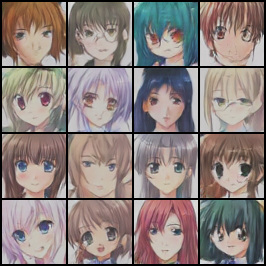

# 🎨 DCGAN — Anime Face Generation

This project implements a **Deep Convolutional Generative Adversarial Network (DCGAN)** using **PyTorch** to generate anime-style faces from random noise vectors.

The model was trained on the **Anime Face Dataset**, which contains approximately 60,000 images. Although the original code was designed for a resolution of 128 × 128 pixels, the provided pre-trained models use a resolution of **64 × 64 pixels** to reduce computation time.

---

## 📁 Repository Structure

```text
.
├── DCGAN_Anime.ipynb
├── generate_images.py
├── generator.pth
├── discriminator.pth
├── requirements.txt
└── generated_images/
    ├── image_000.png
    ├── ...
    └── image_015.png
```

* `DCGAN_Anime.ipynb`: complete notebook containing data exploration, preprocessing, and the training loop.
* `generate_images.py`: standalone Python script used to generate new images from the saved model weights.
* `generator.pth`: pre-trained generator weights.
* `discriminator.pth`: pre-trained discriminator weights.
* `requirements.txt`: list of dependencies required for the project.
* `generated_images/`: directory containing examples of generated faces.

---

## 🛠️ Architecture and Stabilization

Training a GAN is often unstable, particularly because of problems such as *mode collapse*. Several techniques were therefore implemented to improve convergence.

### 1. Spectral Normalization

**Spectral Normalization** is applied to the discriminator. It constrains its Lipschitz constant, preventing the discriminator from becoming overly confident too quickly.

### 2. Different Learning Rates

The following learning rates are used with the Adam optimizer:

* Generator: `0.0002`
* Discriminator: `0.0001`

### 3. Label Smoothing

Real images use a target label of `0.9` instead of `1.0`. This technique prevents the discriminator from becoming excessively confident.

### 4. Decaying Instance Noise

Noise is added to real images at the beginning of training. Its intensity gradually decreases over the epochs.

This technique prevents the discriminator from learning trivial differences between real and generated images too quickly.

### 5. Probability Monitoring

The following probabilities are recorded during training:

* `D(x)`: the discriminator’s confidence for real images.
* `D(G(z))`: the discriminator’s confidence for generated images.

The objective is to monitor the balance between the generator and the discriminator, ideally around `0.5`.

---

## 📦 Installation

Clone the repository and navigate to the project directory:

```bash
git clone REPOSITORY_URL
cd REPOSITORY_NAME
```

Then install the required dependencies:

```bash
pip install -r requirements.txt
```

---

## 💻 Usage

### 1. Image Generation

The `generate_images.py` script generates new anime faces using the pre-trained `generator.pth` model.

The script is configured for a resolution of **64 × 64 pixels**.

To generate 16 images:

```bash
python generate_images.py \
  --generator_path generator.pth \
  --num_images 16 \
  --output_dir ./generated_images
```

### Generating an Image Grid

To generate images and create a summary grid:

```bash
python generate_images.py \
  --generator_path generator.pth \
  --discriminator_path discriminator.pth \
  --grid
```

The `--grid` argument saves a single image containing all the generated faces.

When the discriminator is provided, the script can also display the estimated realism score, `D(G(z))`.

---

## 🔁 Retraining the Model

To start a new training session, open the following notebook:

```text
DCGAN_Anime.ipynb
```

It is recommended to use:

* Google Colab;
* a machine equipped with an NVIDIA GPU;
* or an environment with sufficient VRAM.

> **Warning:** the notebook contains the complete architecture for generating images at a resolution of 128 × 128 pixels. To return to a resolution of 64 × 64 pixels, remove the final `ConvTranspose2d` layer from the generator and adjust the discriminator accordingly.

---

## 📊 Evaluation

The quality of the generated images can be evaluated using the **Fréchet Inception Distance (FID)**.

The notebook includes a routine based on `pytorch-fid` that performs the following steps:

1. selects 500 real images;
2. generates 500 synthetic images;
3. standardizes the image resolutions;
4. calculates the Fréchet distance between the two distributions.

A lower FID score generally indicates better image quality and greater diversity among the generated images.

---

## 🖼️ Examples of Generated Faces

<p align="center">
  
</p>

The image above is loaded directly from the project’s `generated_images` directory.

---

## ✍️ Author

**NASMANE Abdelhak**
Toulouse INP N7 — May 2026
